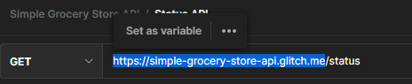
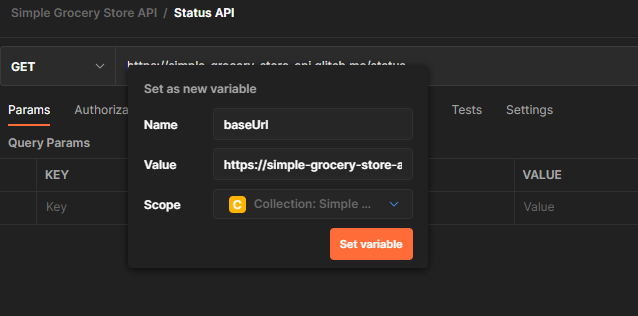
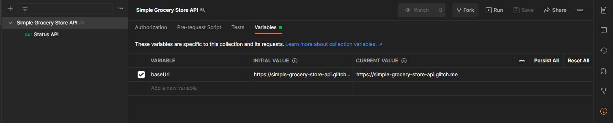
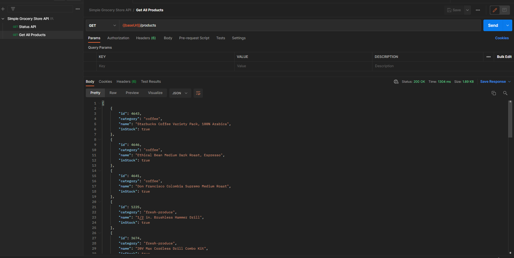
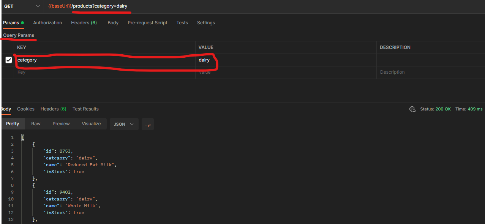
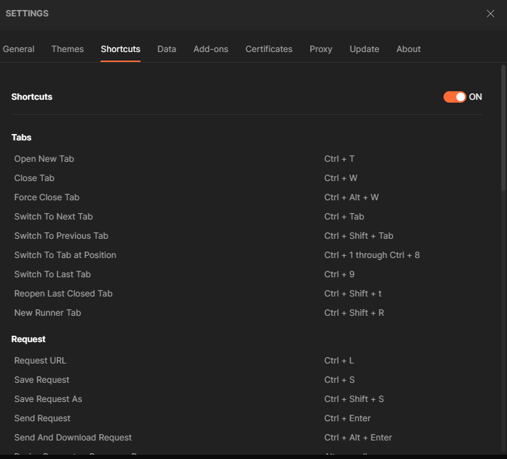
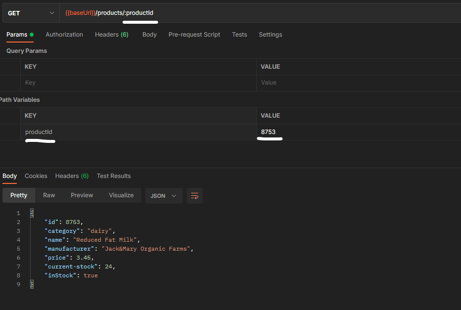
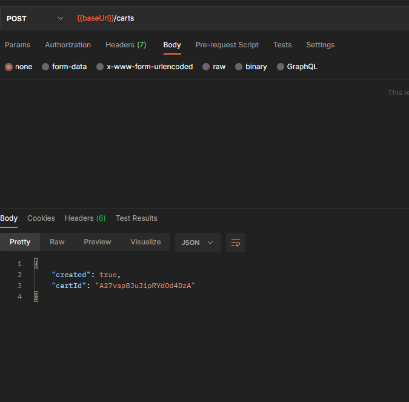
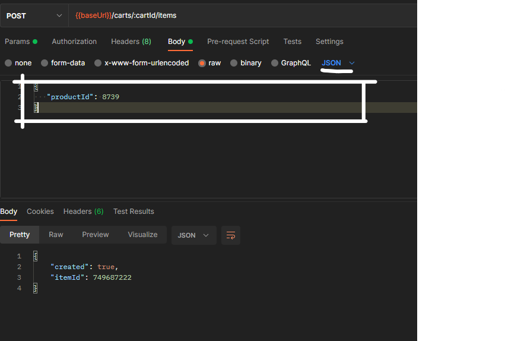

# Creating REST API requests with Postman
* A postman `collection` is a place where we can store our requests. 
* A postman `request` will have default name of URL but it is good to give meaningful names. If we can any changes to collection/request we need to save this as well. 

## Storing Configuration in Variables
* let say we have 20 request in a collection and base url changes so it is good to store it in variable. 
* If you select a text then postman would be pop an option to set it as variable.

* We can choose the scope of the variable. 
* **Variable syntax**: `{{variableName}}`
* You need to save request after creating a variable

## Modifying Collection variables
* You need to go to this collection by clicking on the 3 dots when you hover over collection name then from context menu click on edit. 
* Then you can go to variables tab and edit the variable

* The `initial-value` will be used when you share the collection. The `current-value` is a local private variable for your collection visible to only you even if team is collaborating on same collection. 
* If your variable has secret data then you can set some dummy initial value.

## Get Request
* `Endpoint`: Address of the url where you are sending the request. 
* `Resources`: With REST we deal with resources like here product is resource. 

## Visualizing Response
* In your `Body` section in postman-gui we have options like **pretty, raw, review, visualize**
* It has has by default json formatting selected. 
* **Preview** makes sense with different types of data from any endpoint. Eg make get request to netflix.com

## Query Parameter
* Casing it important for the query parameters. 
* **Syntax**: `?<param_name>=<value>&<param_name2>=<value2>...`
* if a query param is options and you send wrong param then api doesn't report error. 

## Shortcuts
* Go to gear icons in top right then go to shortcuts, then you can go to shortcuts tab. 

## Path Variables
* **Syntax**: `baseurl/<endpoint>/:pathParamName=pathParamValue`
 

# Post
* In below sample we are going to make a post request for no body. The status would return 201 Created. 

