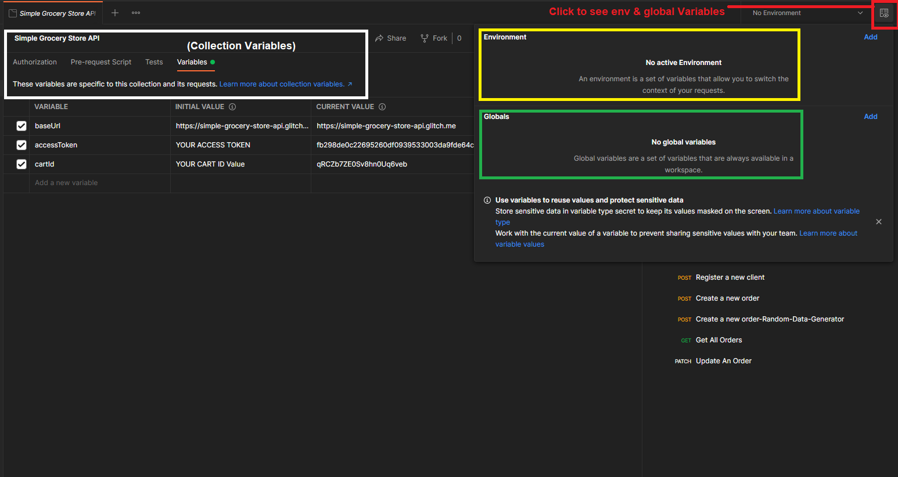
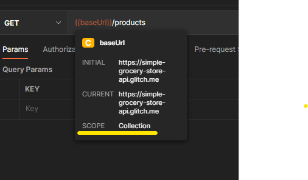
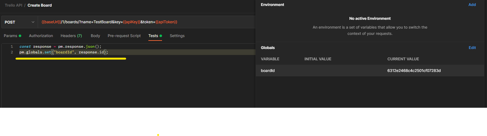
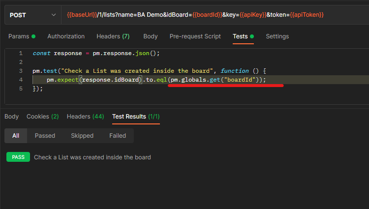
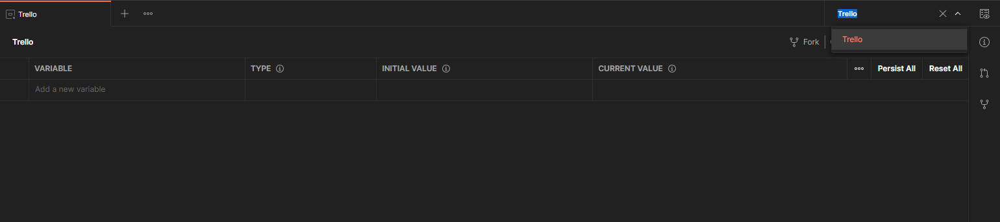
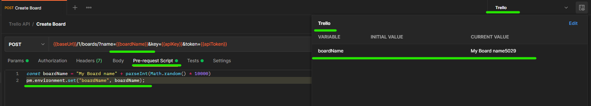

# Test scripts using postman variables
* Postman variables are similar to variables in any programming language. 
## Types of Variables
    1. Global
    2. Environment 
    3. Local 
    4. Data
> **NOTE**: If the variable is in 2 different scope then the variable value is selected from scope which has highest priority. If var is in env and global then env will win as it is much narrow. 

* TO access saved variables in request builder the syntax is `{{myVariable}}`

* If you hover over a variables then it will show it scopes

## Accessing variables in the scripts

* `pm.globals.get("variable_key")`
* `pm.globals.set("variables_key, variable_value);`
* `pm.globals.unset("variable_key") // delete a variables`
* `pm.globals.clear() // delete all variables`

## Global Variables
* In Trello Create board API , when we create board we get a boardId which we need in subsequent calls and we need to automate this process of passing data between requests. 

* Accessing global variables

* To delete a global variables `pm.globals.unset("boardId")`

> **NOTE**: It is good practice to delete the variable once you dont need it.

## Environment Variables
* Similar to global variables but with narrower scope. 
* Ideal for switching between between setups while still using same collection
* Same usage in the request builder as with global variable.

* You can create environments and have variables in them , then whichever environment you select based on that it will get the value of the variable. 

* `pm.environment.get("variable_key")`
* `pm.environment.set("variables_key, variable_value);`
* `pm.environment.unset("variable_key") // delete a variables`
* `pm.environment.clear() // delete all variables`

## Pre-request scripts

* Similar to test scripts but with no assertions and run before request.
* Ideal for making your request dynamic and it is usually used in combination with variables. 
* **Pre-request script(eg calculate a timestamp and save it to a varibales) --> Http Request --> Test**
