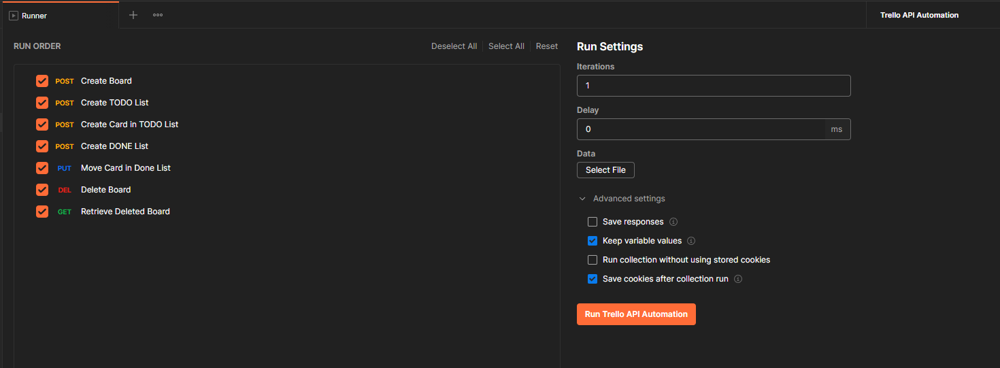
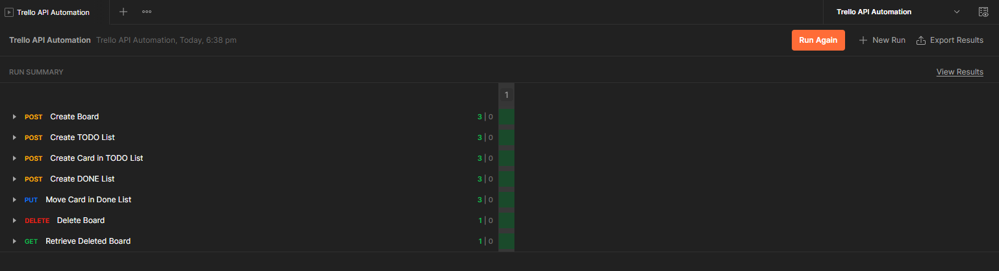

# Automatically running tests
* We can automate using
    1. Collection running 
    2. Postman monitors (Pro feature)
    3. Newman 
    4. Newman + Jenkins 
    5. Newman + other CI servers

## Postman Collection runner 
* After clicking on a collection you will get a **Run** Button and clicking on it will open the collection runner. 
* You need to select the environment, all requests you want to run , iterations, delay, etc

* Once run is completed you will get the run summary and you can export the report as well. 
